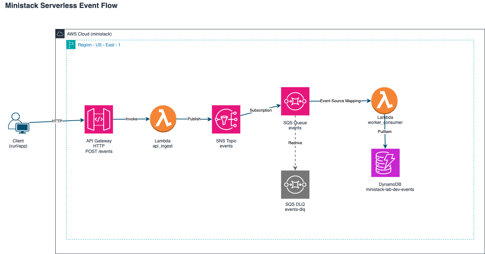

# Ministack Serverless com Terragrunt

Projeto de referencia para arquitetura **serverless event-driven** local, utilizando **Terraform + Terragrunt** com deploy no **ministack/localstack**.

## Visao geral

Fluxo de eventos ponta a ponta com **observabilidade completa** e **resiliência**:

### Fluxo feliz (Happy Path):
```
Client → POST /events → API Gateway → Lambda api_ingest → SNS Topic
         ↓
      (PENDING)
         ↓
SNS → SQS Queue → Lambda worker_consumer → DynamoDB (status=COMPLETED)
```

### Fluxo de recuperacao (Error Handling):
```
Lambda exception → SQS retry (5x) → SQS DLQ → Lambda dlq_consumer 
                                  ↓
                      DynamoDB dlq-events table
                      SNS alert topic
```

### Query de Status (Status Check):
```
Client → GET /events/{id}/status → API Gateway → Lambda status_api → DynamoDB (GetItem)
```

Componentes implementados:

| Modulo | Responsabilidade | CloudWatch Logs | Status |
|--------|------------------|-----------------|--------|
| **api_ingest** | Valida + publica evento no SNS | `/aws/lambda/ministack-lab-dev-api-ingest` | ✅ ATIVO |
| **worker_consumer** | Consome SQS + persiste no DynamoDB | `/aws/lambda/ministack-lab-dev-worker` | ✅ ATIVO |
| **status_api** | Query leitura de status (GetItem) | `/aws/lambda/ministack-lab-dev-status` | ✅ ATIVO |
| **dlq_consumer** | Processa falhas + SNS alertas | `/aws/lambda/ministack-lab-dev-dlq-consumer` | ✅ ATIVO |
| **messaging** | SNS Topic + SQS Queue + DLQ | - | ✅ ATIVO |
| **data_store** | DynamoDB events + dlq-events | - | ✅ ATIVO |

### Features

- ✅ **Logs JSON estruturados** em todas as Lambdas (timestamp, level, message, request_id, custom fields)
- ✅ **Rastreamento de status** com timestamps ingested_at/processed_at
- ✅ **DLQ com reprocessamento** e alertas SNS
- ✅ **API de status** para query de eventos em real-time
- ✅ **Batch processing** com retry automático (5x antes de DLQ)
- ✅ **Local development** 100% funcional no ministack

Diagrama Draw.io: [docs/architecture.drawio](docs/architecture.drawio)

## Desenho da arquitetura



Arquivo editavel no Draw.io: `docs/architecture.drawio`

Versao SVG (fallback): `docs/architecture.svg`

## Estrutura do repositorio

- `infra/modules/messaging`: SNS, SQS e DLQ
- `infra/modules/data_store`: tabelas DynamoDB (events + dlq-events)
- `infra/modules/api_ingest`: API Gateway + Lambda publicadora
- `infra/modules/worker_consumer`: Lambda consumidora + event source mapping
- `infra/modules/status_api`: API Gateway + Lambda para query de status
- `infra/modules/dlq_consumer`: Lambda consumidora de DLQ + alertas SNS
- `infra/envs/dev`: composicao do ambiente e dependencias Terragrunt
- `infra/root.hcl`: configuracoes compartilhadas (remote state e provider)
- `docs/architecture.drawio`: desenho editavel da arquitetura

## Pre-requisitos

- Docker e Docker Compose
- Terraform >= 1.6
- Terragrunt >= 0.55
- AWS CLI (opcional, para inspecao local)

## Subir servicos locais

```bash
docker compose up -d
```

## Provisionar infraestrutura

```bash
cd infra/envs/dev
terragrunt init --all
terragrunt plan --all
terragrunt apply --all -auto-approve
```

## Teste ponta a ponta

### Setup inicial

```bash
# 1) Subir ministack
docker compose up -d

# 2) Provisionar stack
cd infra/envs/dev
terragrunt init --all
terragrunt apply --all -auto-approve

# 3) Exportar URLs
export API_URL="$(cd api_ingest && terragrunt output -raw api_invoke_url_local)"
export STATUS_API_URL="$(cd status_api && terragrunt output -raw api_invoke_url_local)"
```

### Test 1: Fluxo normal (eventos processados com sucesso)

Publicar evento:

```bash
RESP="$(curl -s -X POST "$API_URL/events" \
  -H "Content-Type: application/json" \
  -d '{"type":"order.created","amount":123.45}')"

EVENT_ID="$(echo "$RESP" | sed -E 's/.*"eventId"[[:space:]]*:[[:space:]]*"([^"]+)".*/\1/')"
echo "Evento criado: $EVENT_ID"
echo "$RESP"
```

Resposta esperada:
```json
{"message":"event accepted","eventId":"c941a868-f291-480d-907a-ade35bbfe81d"}
```

Query status após 2-5 segundos:

```bash
curl -s "$STATUS_API_URL/events/$EVENT_ID/status" | jq .
```

Resposta esperada (depois da Lambda worker processar):
```json
{
  "id": "c941a868-f291-480d-907a-ade35bbfe81d",
  "status": "COMPLETED",
  "ingested_at": "2026-04-14T16:30:01.009064+00:00",
  "processed_at": "2026-04-14T16:30:01.798530+00:00",
  "type": "order.created"
}
```

### Test 2: Validar persistencia em DynamoDB

```bash
aws dynamodb scan \
  --table-name ministack-lab-dev-events \
  --endpoint-url http://localhost:4566 | jq '.Items[] | {pk, sk, status, type}'
```

### Test 3: DLQ end-to-end (forçar falha e validar retry + redrive)

Publicar evento com `force_fail: true` para simular exceção na worker:

```bash
RESP="$(curl -s -X POST "$API_URL/events" \
  -H "Content-Type: application/json" \
  -d '{"type":"order.failed.test","force_fail":true,"amount":10}')"

FAIL_EVENT_ID="$(echo "$RESP" | sed -E 's/.*"eventId"[[:space:]]*:[[:space:]]*"([^"]+)".*/\1/')"
echo "Evento para falha: $FAIL_EVENT_ID"
```

Monitorar worker enquanto processa:

```bash
aws logs tail /aws/lambda/ministack-lab-dev-worker --follow --endpoint-url http://localhost:4566
# Esperado: erro "forced failure for DLQ validation" repetido 5x até entrar em DLQ
```

Depois de ~30 segundos, verificar se foi para DLQ:

```bash
aws dynamodb scan \
  --table-name ministack-lab-dev-dlq-events \
  --endpoint-url http://localhost:4566 | jq '.Items[] | {pk, reason, recorded_at}'
```

Esperado: registro com prefixo `DLQ#...` e reason contendo "forced failure".

Ver alertas SNS enviados pela DLQ consumer:

```bash
aws logs tail /aws/lambda/ministack-lab-dev-dlq-consumer --follow --endpoint-url http://localhost:4566
# Esperado: logs JSON com mensagem de alerta SNS publicada
```

### Test 4: Status API com evento em timeout

```bash
curl -s "$STATUS_API_URL/events/nonexistent-id/status"
```

Resposta esperada:
```json
{"error": "event not found"}
```

## Observabilidade e Debugging

### Logs estruturados (JSON no CloudWatch)

Todas as Lambdas emitem logs em formato JSON para facilitar parsing e querying:

**Exemplo de log da api_ingest:**
```json
{
  "timestamp": "2026-04-14T16:30:01.123456+00:00",
  "level": "INFO",
  "message": "Event published to SNS",
  "request_id": "d81be5c6-79a6-4d12-8c37-8008e10b05c8",
  "event_id": "d81be5c6-79a6-4d12-8c37-8008e10b05c8",
  "event_type": "order.created"
}
```

**Exemplo de log da worker_consumer:**
```json
{
  "timestamp": "2026-04-14T16:30:01.234567+00:00",
  "level": "INFO",
  "message": "Event persisted",
  "event_id": "d81be5c6-79a6-4d12-8c37-8008e10b05c8",
  "table_name": "ministack-lab-dev-events"
}
```

**Exemplo de log do dlq_consumer:**
```json
{
  "timestamp": "2026-04-14T16:30:15.345678+00:00",
  "level": "WARNING",
  "message": "DLQ message received",
  "event_id": "d81be5c6-79a6-4d12-8c37-8008e10b05c8",
  "reason": "forced failure for DLQ validation"
}
```

### Acessar logs Lambda

Monitorar logs em tempo real:

```bash
# API Ingest
aws logs tail /aws/lambda/ministack-lab-dev-api-ingest --follow --endpoint-url http://localhost:4566

# Worker Consumer
aws logs tail /aws/lambda/ministack-lab-dev-worker --follow --endpoint-url http://localhost:4566

# Status API
aws logs tail /aws/lambda/ministack-lab-dev-status --follow --endpoint-url http://localhost:4566

# DLQ Consumer
aws logs tail /aws/lambda/ministack-lab-dev-dlq-consumer --follow --endpoint-url http://localhost:4566
```

Buscar logs por padrão:

```bash
# Procurar eventos com erro
aws logs filter-log-events \
  --log-group-name /aws/lambda/ministack-lab-dev-worker \
  --filter-pattern "ERROR" \
  --endpoint-url http://localhost:4566

# Procurar por request_id específico
aws logs filter-log-events \
  --log-group-name /aws/lambda/ministack-lab-dev-api-ingest \
  --filter-pattern "d81be5c6-79a6-4d12-8c37-8008e10b05c8" \
  --endpoint-url http://localhost:4566
```

### Inspecionar filas SQS

Ver fila principal e DLQ:

```bash
MAIN_Q_URL="$(cd infra/envs/dev/messaging && terragrunt output -raw sqs_queue_url)"
DLQ_URL="$(cd infra/envs/dev/messaging && terragrunt output -raw dlq_queue_url)"

# Depth main queue
aws sqs get-queue-attributes \
  --queue-url "$MAIN_Q_URL" \
  --attribute-names ApproximateNumberOfMessages ApproximateNumberOfMessagesNotVisible \
  --endpoint-url http://localhost:4566

# Depth DLQ
aws sqs get-queue-attributes \
  --queue-url "$DLQ_URL" \
  --attribute-names ApproximateNumberOfMessages \
  --endpoint-url http://localhost:4566
```

Ler mensagens da DLQ:

```bash
aws sqs receive-message \
  --queue-url "$DLQ_URL" \
  --endpoint-url http://localhost:4566 | jq '.Messages[].Body | fromjson'
```

### Inspecionar DynamoDB

Events principais:

```bash
aws dynamodb scan \
  --table-name ministack-lab-dev-events \
  --endpoint-url http://localhost:4566 | jq '.Items[] | {id: .pk.S, status: .status.S, type: .type.S}'
```

Failed events (DLQ table):

```bash
aws dynamodb scan \
  --table-name ministack-lab-dev-dlq-events \
  --endpoint-url http://localhost:4566 | jq '.Items[] | {event_id: .event_id.S, reason: .reason.S, at: .recorded_at.S}'
```

Query evento específico:

```bash
EVENT_ID="d81be5c6-79a6-4d12-8c37-8008e10b05c8"
aws dynamodb get-item \
  --table-name ministack-lab-dev-events \
  --key "{\"pk\": {\"S\": \"EVENT#$EVENT_ID\"}, \"sk\": {\"S\": \"v1\"}}" \
  --endpoint-url http://localhost:4566
```

## Limitacoes do ministack/localstack

O ministack/localstack é otimo para desenvolvimento local, mas tem algumas limitacoes em relacao a AWS real:

| Feature | Ministack | AWS Real | Impacto |
|---------|-----------|----------|--------|
| Lambda event source mapping (SQS) | ❌ Nao funciona | ✅ Funciona | Worker nao é automaticamente acionado por SQS |
| Lambda event source mapping (SNS) | ⚠️ Limitado | ✅ Funciona | SNS->Lambda pode falhar em cenarios complexos |
| CloudWatch Metrics | ⚠️ Basico | ✅ Completo | Sem alarms customizadas, namespaces limitados |
| IAM policy validation | ❌ Ignora | ✅ Valida | Policies fake, qualquer coisa é aceita |
| X-Ray tracing | ❌ Nao funciona | ✅ Funciona | Sem distributed tracing |

### Workaround: Lambda manual invoke para testar worker

Como o ministack nao dispara worker automaticamente via SQS, você pode testar manualmente:

```bash
# Criar payload simulando SQS
cat > /tmp/sqs_msg.json << 'EOF'
{
  "Records": [
    {
      "body": "{\"id\":\"evt-123\",\"type\":\"order.created\",\"amount\":100}",
      "messageId": "msg-001"
    }
  ]
}
EOF

# Invocar worker Lambda diretamente
aws lambda invoke \
  --function-name ministack-lab-dev-worker \
  --invocation-type RequestResponse \
  --payload file:///tmp/sqs_msg.json \
  --endpoint-url http://localhost:4566 \
  /tmp/response.json

# Ver resposta
cat /tmp/response.json | jq .
```

Depois verificar DynamoDB para confirmar persistencia:

```bash
aws dynamodb scan \
  --table-name ministack-lab-dev-events \
  --endpoint-url http://localhost:4566 | jq '.Items[-1]'
```

### Para producao (AWS real)

Simplesmente remover os overrides de endpoint em `infra/root.hcl` e as event source mappings funcionarao automaticamente.


| Erro | Causa | Solução |
|------|-------|---------|
| `Unknown path` ou `Stage not found` | URL de API incorreta | Use `api_invoke_url_local` com `/$default/events` no final |
| `Unable to locate credentials` | Variáveis de ambiente desatualizadas | `cd infra/envs/dev && terragrunt apply worker_consumer -auto-approve` |
| `No module named boto3` | Dependências não packaged no ZIP | `cd infra/envs/dev && terragrunt apply MODULE -auto-approve` (força rebuild) |
| `UnrecognizedClientException` | Provider não apontando para localstack | Verifique `root.hcl` tem `endpoint_url = "http://localhost:4566"` |
| Evento não aparece em status API | Worker não processou ainda | Aguarde 5-10s (batch processing), check logs worker: `aws logs tail /aws/lambda/ministack-lab-dev-worker --since 1m` |
| DLQ vazio mesmo com force_fail | Redrive policy não configurada | Verifique `SQS_Queue.redrive_policy.maxReceiveCount` = 5 e `function_response_types = ["ReportBatchItemFailures"]` |
| Logs vazios | Lambda não foi executada | Check status API responses e `aws logs group /aws/lambda/ministack-lab-dev-*` existem |
| Terraform: "Unknown attribute" | Estado antigo desincronizado | `terragrunt init --all` novamente + `terragrunt plan --all` |

### Debug detalhado de erro em eventos

```bash
# 1) Publicar evento que deve falhar
EVENT_ID="$(curl -s -X POST "$API_URL/events" \
  -H "Content-Type: application/json" \
  -d '{"type":"test.fail","force_fail":true}' | \
  sed -E 's/.*"eventId"[[:space:]]*:[[:space:]]*"([^"]+)".*/\1/')"

# 2) Tail logs worker em tempo real (veja falhas sendo retentadas)
aws logs tail /aws/lambda/ministack-lab-dev-worker --follow --endpoint-url http://localhost:4566 &

# 3) Aguardar 30-40 segundos (5 retries x batch window)

# 4) Verificar se foi para DLQ
aws dynamodb scan --table-name ministack-lab-dev-dlq-events --endpoint-url http://localhost:4566 | \
  jq '.Items[] | select(.event_id.S == "'$EVENT_ID'")'

# 5) Verificar se DLQ consumer foi acionado
aws logs tail /aws/lambda/ministack-lab-dev-dlq-consumer --since 1m --endpoint-url http://localhost:4566
```

## Desenvolvimento local

### Estrutura de módulos

Cada módulo contém:
- `main.tf` - recursos AWS (IAM, Lambda, API Gateway, etc)
- `variables.tf` - inputs do módulo
- `outputs.tf` - outputs para dependências
- `versions.tf` - requirements Terraform + providers
- `lambda_src/handler.py` - código Python da Lambda
- `lambda_src/requirements.txt` - dependências pip

### Adicionar novo evento to pipeline

1. **Publicar** via `POST /events`:
   - body = qualquer JSON com `type: string`
   - API ingest valida + publica em SNS com MessageAttribute `eventType`

2. **Processar** na worker:
   - SQS entrega batch de mensagens
   - Worker itera e escreve em DynamoDB com `status: COMPLETED`
   - Se `force_fail: true`, lança erro (tested via DLQ)

3. **Consultar status** via `GET /events/{id}/status`:
   - Status API faz GetItem no DynamoDB eventos table
   - Retorna status + timestamps (ingested_at, processed_at)

### Modificar código da Lambda

Editar arquivo de handler (ex: `infra/modules/worker_consumer/lambda_src/handler.py`):

```python
def lambda_handler(event, context):
    # seu código
    _structured_log("INFO", "mensagem", custom_field="valor")
    return {...}
```

Não esquecer de dependências em `requirements.txt`!

Deploy:
```bash
cd infra/envs/dev/MODULE_NAME
terragrunt apply -auto-approve  # força repackage + redeploy
```

### Executar testes locais sem deploy

```bash
# Simular handler localmente
cd infra/modules/worker_consumer/lambda_src
python3 handler.py  # or unit tests

# Com dependências:
pip install -r requirements.txt
python3 -m pytest tests/  # if exists
```

## Tree do projeto

```
.
├── docker-compose.yml          # ministack + localstack
├── README.md                   # este arquivo
├── docs/
│   ├── architecture.drawio     # editar em draw.io
│   ├── architecture.png
│   └── architecture.svg
└── infra/
    ├── root.hcl                # provider + backend comum
    ├── state/                  # tfstate local
    ├── modules/
    │   ├── messaging/          # SNS + SQS + DLQ
    │   │   ├── main.tf
    │   │   ├── outputs.tf
    │   │   ├── variables.tf
    │   │   └── versions.tf
    │   ├── data_store/         # DynamoDB events + dlq-events
    │   ├── api_ingest/         # API Gateway + Lambda ingest
    │   │   └── lambda_src/
    │   │       ├── handler.py
    │   │       └── requirements.txt
    │   ├── worker_consumer/    # Lambda worker + event source mapping
    │   │   └── lambda_src/
    │   ├── status_api/         # API Gateway status + Lambda query
    │   │   └── lambda_src/
    │   ├── dlq_consumer/       # Lambda DLQ + SNS alertas
    │   │   └── lambda_src/
    │   └── serverless_api/     # (deprecated, referência antiga)
    └── envs/
        └── dev/
            ├── env.hcl         # common inputs
            ├── messaging/
            │   └── terragrunt.hcl
            ├── data_store/
            │   └── terragrunt.hcl
            ├── api_ingest/
            │   └── terragrunt.hcl
            ├── worker_consumer/
            │   └── terragrunt.hcl
            ├── status_api/
            │   └── terragrunt.hcl
            └── dlq_consumer/
                └── terragrunt.hcl
```
## Cleanup e Deployment

### Destruir infraestrutura local

```bash
cd infra/envs/dev
terragrunt destroy --all -auto-approve
```

Parar ministack:
```bash
docker compose down
```

### Deploy em staging/prod (referência)

Para AWS real, apenas alterar provider + backend:

```hcl
# infra/root.hcl - AWS real
backend "s3" {
  bucket         = "my-terraform-state"
  key            = "ministack-lab/terraform.tfstate"
  region         = "us-east-1"
  dynamodb_table = "terraform-locks"
}

provider "aws" {
  region = var.aws_region  # "us-east-1", etc
  # remover endpoint overrides
}
```

Depois:
```bash
cd infra/envs/staging  # ou prod
terragrunt apply --all -auto-approve
```

## Próximos passos (opcional)

- [ ] Adicionar staging env (`infra/envs/staging`)
- [ ] GitHub Actions para apply automático
- [ ] Terraform tests com terratest
- [ ] API authentication (Lambda authorizer)
- [ ] CloudWatch alarms e SNS subscriptions
- [ ] Grafana para métricas

## License

MIT